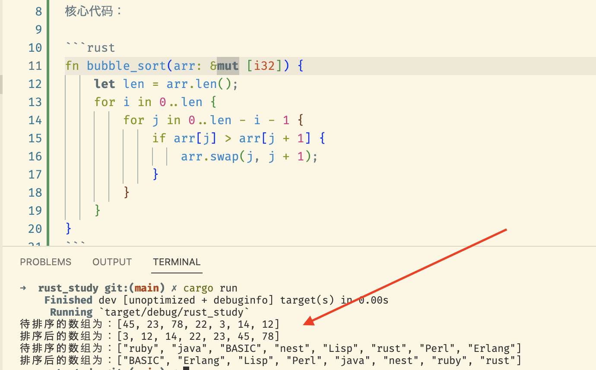

# rust

## 使用 rust 实现冒泡排序

【核心知识】：rust 所有权问题

【问题】：在对数组进行操作（比如参数传递）有很多问题，目前只是简单实现冒泡排序，请阅读 rust 文档后进行改进

### 核心代码：

```rust
fn bubble_sort(arr: &mut [i32]) {
    let len = arr.len();
    for i in 0..len {
        for j in 0..len - i - 1 {
            if arr[j] > arr[j + 1] {
                arr.swap(j, j + 1);
            }
        }
    }
}
```

### 代码运行结果：



### 待改进：

- [ ] 不修改原数组
- [ ] 可交互，支持输入数组
- [ ] 校验是否为输入参数的合法性
- [ ] 是否要自定义比较函数
