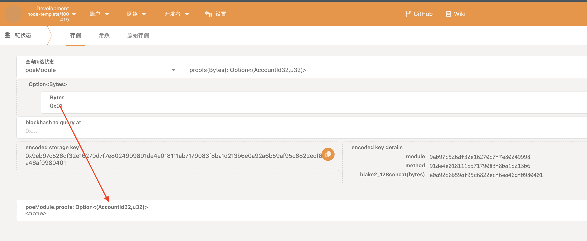
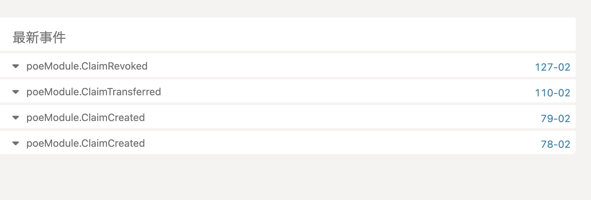

## homework05

### 运行结果

测试：使用 Alice 创建存证 0x01 和 0x02，然后吊销存证 0x01，并将 0x02 transfer 给 Bob
Alice：5GrwvaEF5zXb26Fz9rcQpDWS57CtERHpNehXCPcNoHGKutQY
Bob：5FHneW46xGXgs5mUiveU4sbTyGBzmstUspZC92UhjJM694ty

查询存证"0x01"，结果为`None`：

创建存证 0x01 和 0x02，如下图所示，0x01 所有者是 Alice，存储区块为 78；0x02 所有者为 Alice，存储区块为 79


将 0x02 transfer 给 Bob，如下图所示，所有者为 Bob

我们上述操作的所有事件：


### 代码

```rust
#![cfg_attr(not(feature = "std"), no_std)]
/// Edit this file to define custom logic or remove it if it is not needed.
/// Learn more about FRAME and the core library of Substrate FRAME pallets:
/// <https://docs.substrate.io/reference/frame-pallets/>
pub use pallet::*;

#[frame_support::pallet]
pub mod pallet {
	use frame_support::pallet_prelude::*;
	use frame_system::pallet_prelude::*;

	#[pallet::config]
	pub trait Config: frame_system::Config {
		#[pallet::constant]
		type MaxClaimLength: Get<u32>;
		type RuntimeEvent: From<Event<Self>> + IsType<<Self as frame_system::Config>::RuntimeEvent>;
	}

	#[pallet::pallet]
	#[pallet::generate_store(pub(super) trait Store)]
	pub struct Pallet<T>(_);

	#[pallet::storage]
	#[pallet::getter(fn proofs)]
	pub type Proofs<T: Config> = StorageMap<
		_,
		Blake2_128Concat,
		BoundedVec<u8, T::MaxClaimLength>,
		(T::AccountId, T::BlockNumber),
	>;

	#[pallet::event]
	#[pallet::generate_deposit(pub(super) fn deposit_event)]
	pub enum Event<T: Config> {
		ClaimCreated(T::AccountId, BoundedVec<u8, T::MaxClaimLength>),
		ClaimRevoked(T::AccountId, BoundedVec<u8, T::MaxClaimLength>),
		ClaimTransferred(T::AccountId, T::AccountId, BoundedVec<u8, T::MaxClaimLength>),
	}

	#[pallet::error]
	pub enum Error<T> {
		ProofAlreadyExist,
		ClaimTooLong,
		ClaimNotExist,
		NotClaimOwner,
	}

	#[pallet::hooks]
	impl<T: Config> Hooks<BlockNumberFor<T>> for Pallet<T> {}

	#[pallet::call]
	impl<T: Config> Pallet<T> {
		#[pallet::call_index(0)] // 可调用顺序
		#[pallet::weight(0)] // 指定权重
		pub fn create_claim(
			origin: OriginFor<T>,
			claim: BoundedVec<u8, T::MaxClaimLength>,
		) -> DispatchResultWithPostInfo {
			let sender = ensure_signed(origin)?;
			ensure!(!Proofs::<T>::contains_key(&claim), Error::<T>::ProofAlreadyExist);

			Proofs::<T>::insert(
				&claim,
				(sender.clone(), frame_system::Pallet::<T>::block_number()),
			);
			// 存储成功后触发一个ClaimCreated事件，存证被创建
			Self::deposit_event(Event::ClaimCreated(sender, claim));
			Ok(().into())
		}

		#[pallet::call_index(1)]
		#[pallet::weight(0)]
		pub fn revoke_claim(
			origin: OriginFor<T>,
			claim: BoundedVec<u8, T::MaxClaimLength>,
		) -> DispatchResultWithPostInfo {
			let sender = ensure_signed(origin)?;
			let (owner, _) = Proofs::<T>::get(&claim).ok_or(Error::<T>::ClaimNotExist)?;
			ensure!(owner == sender, Error::<T>::NotClaimOwner);

			Proofs::<T>::remove(&claim);

			Self::deposit_event(Event::ClaimRevoked(sender, claim));
			Ok(().into())
		}
  // 转移凭证
		#[pallet::call_index(2)]
		#[pallet::weight(0)]
		pub fn transfer_claim(
			origin: OriginFor<T>,
			claim: BoundedVec<u8, T::MaxClaimLength>,
			to: T::AccountId,
		) -> DispatchResultWithPostInfo {
			let sender = ensure_signed(origin)?;
			let (owner, block_number) =
				Proofs::<T>::get(&claim).ok_or(Error::<T>::ClaimNotExist)?;

			ensure!(owner == sender, Error::<T>::NotClaimOwner);

			Proofs::<T>::insert(&claim, (to.clone(), block_number));
			Self::deposit_event(Event::ClaimTransferred(sender, to, claim));
			Ok(().into())
		}
	}
}

```
