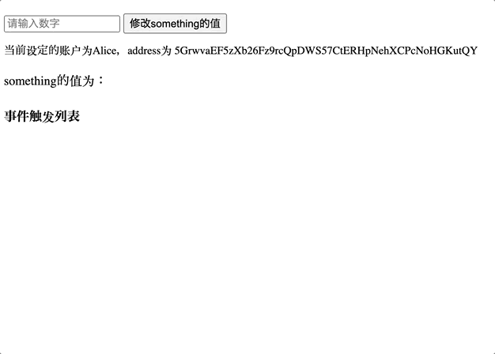

## 作业

编写一个类型脚本程序来订阅 template pallet 中的值的更新（something）和 event。
要求：类型脚本源代码；程序运行截图，输出 something 的新值和 SomethingStored 的事件

1. 订阅 something 值
2. apps transfer，subscribe SomethingStored 事件
3. 前端调用 doSomething，在页面打印事件与新值

## 运行

请先启动节点，在该项目中执行以下命令：

```
yarn install
yarn dev

```

## 前端代码运行效果


